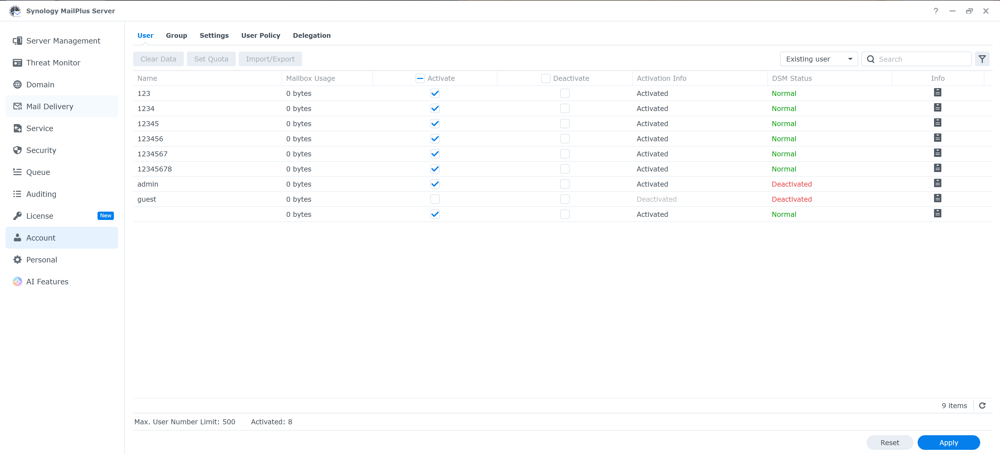

# Research Findings: Disclaimer

This research is intended to examine methods related to restrictions in the registration process of commercial software solely for the purposes of academic study and technical knowledge exchange.

## Special Notice

This research is intended exclusively for academic research and technical education. It must not be used for any illegal or improper purposes, including, but not limited to, commercial exploitation, copyright infringement, or destructive activities.

The publication of these research findings does not constitute approval, encouragement, or endorsement of any methods aimed at bypassing restrictions, nor does it assume responsibility for any legal consequences arising from such actions.

Users must ensure that they have obtained proper authorization from the software vendor and comply with all applicable laws and regulations before performing any related operations.

This disclaimer does not exempt any violations of laws or regulations. The author shall not be held responsible for any legal consequences, financial losses, or other adverse outcomes resulting from the use of these research findings.

Users are advised to consciously comply with all applicable laws and regulations and to take full responsibility for their own actions when using the results of this research.

## Analysis of the Registration Process

This research is provided for technical discussion and academic exchange only. Unauthorized discussion, distribution, or misuse of the information is prohibited.

## Conclusion

Overall, the implementation of the license addition algorithm remains sufficiently secure.

```
	synopki_init
	synopki_activated
	synopki_encrypt
	synopki_decrypt
	synopki_set_pk_signature
	synopki_verify_sign_key
	synopki_verify_sig_by_ed25519_pk
	Z85_encode
	Z85_decode
```

## Trust Chain Structure

```
Embedded Synology public key

↓ Verification of the signature file (/usr/syno/etc/license/private/Sing.9)

↓ Verification of the node public key in Vault

↓ Used for encryption/decryption and signature verification
```

In simplified terms, the trust chain is built around an embedded Synology public key. This key is used to verify the signature file located at `/usr/syno/etc/license/private/Sing.9`. After that, the node public key stored in Vault is verified. Once the node key is trusted, it can be used for encryption, decryption, and signature verification operations

---
**SUPPORT**
[Telegram Group](https://t.me/+Px6SYt7ESD05MDMy)


### Buy me a coffee

If this code helped you and you would like to support my work:

BTC: bc1qptkfe42lcrrkwk5pr96spyfdmvwyx6gaq5vf0q94z2sz83djys3qdzrqjc


## Synology MailPlus Server Research Notes 4.0.1-31663

This repository contains technical notes related to Synology MailPlus Server behavior in a local lab environment.

The general process is:

1. Stop MailPlus Server.
2. Check and adjust the correct volume path.
3. Back up the original files.
4. Apply authorized lab changes.
5. Restore proper file permissions.
6. Start MailPlus Server and verify the result.

> This project is for educational research only.
> It does not provide or support license bypassing, cracking, redistribution of proprietary files, or unauthorized modification of commercial software.

change volum number

echo "0.0.0.0 license.synology.com" | sudo tee -a /etc/hosts

sudo chmod a=rwx "/volume/@appstore/MailPlus-Server/lib/libmailserver-license.so.1.0"
sudo chmod a=rwx "/volume/@appstore/MailPlus-Server/lib/"

sudo chmod 755 "/volume/@appstore/MailPlus-Server/lib/libmailserver-license.so.1.0"
sudo chmod 755 "/volume/@appstore/MailPlus-Server/lib/"

img/https://github.com/YagaWitch/MailPlus-Server/blob/main/s.png



